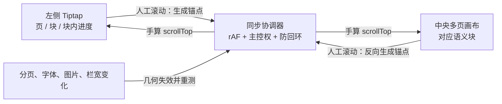

# 小红书排版编辑器后续迭代路线（2026-08-12）

> 基线：生产版仍为 **v1.7.2**。本文只记录需求优先级与实施方案，不代表功能已经开发、测试或发布。
> 2026-08-12 晚间更新：表中 P0（v1.7.3）已发布闭环（见 HANDOFF §0）；「Gate 0 诊断」已完成，疑点不成立，结论见 `docs/FONT-GATE0-2026-08-12.md`。

## 1. 优先级结论

| 优先级 | 建议版本 / 门禁 | 迭代项 | 结论 |
|---|---|---|---|
| **P1** | **v1.8.0** | **编辑区 ↔ 成品预览长文双向滚动联动** | 用户已明确提出，已完成需求与架构标记；下一功能版首选，尚未开发 |
| **P0** | **v1.7.3「末行闭标点判定 + 导出预检分级版」** | **求解器末行闭标点假阳性修复 + `REQ-EXPORT-PREFLIGHT-OVERRIDE`**（见 §3） | 2026-08-12 用户真实被阻案例；根因是段落末行对闭标点用完整逻辑 box 判宽产生 `unsatisfied-line` 假阳性（逻辑 box 仅超 1.108px、句号可见墨迹仍在版心内 6.372px）。先修求解器根因，再做预检 warning/blocking 分级与「按当前预览强制导出」二次确认；原 P2 `REQ-PREFLIGHT-GUIDANCE`（段落定位与修改建议）并入本需求。完整实施边界见 HANDOFF §1 条款 21 与「P0 待实现」节，尚未开发 |
| ~~P1~~ ✅ | ~~Gate 0 诊断~~ 2026-08-12 完成 | CDN 可选字体的生产预览 / 导出 A/B | **疑点不成立**：5 个 CDN 字体在两生产入口的预览与导出均真实生效（克隆 iframe `<link>` 重载补上被跳过的跨域 @font-face）。无需当期补丁；字体本地化降级为纯性能/可靠性优化。证据与残余风险见 `docs/FONT-GATE0-2026-08-12.md` |
| P2 | ≥ v1.9.0，按诊断拆批 | 字体本地化、减重与标题字重档位 | 不做“全部字体直接打包”；按真实使用率、unicode 分片和可用 weight 设计 |
| P2 | 独立功能版 | 结构化封面槽位与三套版式 | 主标题 / 副标题槽位；左对齐叠排、居中海报、小字在上大字在下；只开放有限位置调整，不做自由文本框和复杂网格 |
| P2 | 可靠性版 | 跨刷新目录续写 | 当前仅支持同一页面会话续写；后续评估目录句柄持久化、重新授权与已有文件核验 |
| P2 | 先量化再决定 | 清理 `hasRaceArtifact + retry` | v8 后基本是保险，但纯黑右缘会误判并多渲染；必须先用生产矩阵证明可安全删除 |
| P2 | 小型产品契约审计 | 隐藏快捷键去留 | 明确 inline code / strike / code block 等继承行为是正式支持还是禁用，避免把偶然行为变成承诺 |
| P2 | 真实需求触发 | PWA 与资源自诊断 | 出现明确安装诉求或重复线上故障后再立项；不与 Tauri 同时开工 |
| P3 | 有 37+ 页真实样本后 | 上传分组与整体重均衡 | 这是发布工作流优化，不是当前完整导出的缺陷；先收集真实平台流程和长文样本 |
| P3 | 平台规则重新调研后 | 小红书原生长文管线 | 与普通图文是另一条平台管线，需单独确认账号能力、接口与当期规则 |
| P3 | 明确出现内容骨架需求后 | 独立 `PosterTemplate` | Theme 继续只管视觉；只有要携带正文骨架、封面字段和页类型时才新增 Template 模型 |
| P3 | 条件触发 | 手机端独立壳、SaaS / 产品首页、Tauri | 手机端必须是共享引擎 + 独立触控壳；SaaS 先有云同步 / 登录 / 付费需求；Tauri 只服务明确的离线桌面分发 |

已完成项不再回收到待办：Markdown / 纯文本导入、独立发布文案、18 / 19+ 完整导出、中文两端对齐、确定性预览 / 导出排版、列表安全分页、全局撤销重做与公考双底图均已进入生产。复杂网格也已明确否决。

---

## 2. 已 Mark 需求：REQ-LONGDOC-SCROLL-SYNC

### 2.1 用户目标

在桌面三栏工作台中：

- 用户滚动左侧正文编辑区时，中间成品画布自动定位到**同一页、同一内容块附近**；
- 用户滚动中间成品画布时，左侧正文编辑区反向定位；
- 任一侧发生新的人工滚动时，该侧立即成为主控侧，不能来回抢滚动或抖动；
- 联动只改变两个滚动容器的 `scrollTop`，不得改变光标、选区、正文 JSON、草稿 schema、分页结果或导出 DOM。

建议交互：默认开启；在「成品画布」标题栏放一个轻量的「滚动联动」开关，关闭后两栏完全独立。开关只属于当前会话，不进入草稿、撤销历史或导出数据。

### 2.2 架构结论

**采用“视口中心语义锚点”，不采用全文滚动百分比。**

左侧是适合输入的紧凑 Tiptap 排版，中间是按页拆分、带主题 / 字体 / 图片的 1080×1800 真实排版；两侧总高度并非线性对应。直接同步 `scrollTop / scrollHeight` 会随着标题、长段落、列表、图片和页间距持续漂移。



首版锚点模型：

```ts
interface DocumentScrollAnchor {
  pageIndex: number
  blockIndex: number
  blockProgress: number // 0..1，视口中心位于当前块内部的相对位置
}
```

- **左侧锚点**：读取 `.ProseMirror` 的直接子节点；根级 `hr.page-break` 划分页，其他直接子节点按页内顺序编号。
- **中间锚点**：对应页 `.content` 的直接子节点；确定性排版可以重建块内字形，但必须保留顶层标题、段落、列表、引用、代码块和图片的顺序。
- **长块处理**：同一个长段落、长列表或大图用 `blockProgress` 保留块内进度，不只跳到块首。
- **空页处理**：连续分页符、首 / 尾分页产生的空页退化为页级锚点，映射到相邻分页符位置与整张空画布中心。
- **页间 / 块间空白**：视口中心没有命中任何块时选择几何距离最近的可见块或页面；距离相同固定选择后一个，避免同一位置来回翻转。
- **画布溢出**：未溢出的内容精确到块；若目标块已经落到固定 1080×1800 画布的 `overflow:hidden` 区域之外，中栏无法把它滚进可见区，必须退化为对应页 / 安全区边界定位并保留现有溢出警告，不宣称该块可见。
- **首版不持久化 `syncId`**：左右 DOM 同源且顶层顺序一致，使用临时的 `(pageIndex, blockIndex)` 即可；避免为滚动功能升级文档 schema。若后续加入异构页模板，再评估稳定块 ID。

### 2.3 同步协调器

1. 两侧 `scroll` 监听器均使用 `requestAnimationFrame` 合帧，单帧最多执行一次测量与写入。
2. 用 `source / target / expectedScrollTop` 记录本次程序滚动事务；目标侧由程序触发的 `scroll` 事件只确认到位，不反向发起新事务。
3. 保留约 250ms 的超时仅作兜底；目标侧收到 `wheel`、`pointerdown`、`touchstart` 或滚动类键盘输入时立即接管主控权，不能让固定静默窗吞掉用户操作。
4. 手工计算目标容器内的 `scrollTop` 并 clamp，不使用 `scrollIntoView`，避免连带滚动页面或祖先容器。
5. 中栏视口中心要从 sticky 标题的真实 `getBoundingClientRect()` 计算（当前高度约 58px），不硬编码假设；不使用 `behavior: smooth`，避免连续滚动叠加动画。
6. 每次投影先比较左右结构签名（页数 + 每页顶层块数）；若 Tiptap 已更新而 Preview 仍在上一帧，跳过本帧并在下一帧重试，绝不把新锚点投到旧 DOM。
7. 内容更新、增删分页、切换草稿 / 主题 / 字号 / 密度、字体完成加载、图片完成解码、栏宽变化后，让几何缓存失效；使用现有 layout revision 配合 `ResizeObserver` / `document.fonts`，只从当前主控侧重新投影目标侧。
8. 草稿 id 或导入生成的文档 identity 变化时，完整清除旧锚点、主控权、静默截止时间、待确认目标和 rAF；等左右新 DOM 的结构签名一致后保持静止，直到第一次人工滚动再建立新锚点，绝不把 19 页旧草稿位置套到 1 页新草稿。
9. 目标 `scrollTop` 在首尾被 clamp 时标记为“已饱和”；由此产生的位置差只确认事务，不反向纠偏，避免顶部 / 底部回弹。
10. 图片缩放 / 对齐手势期间不主动抢滚动；手势结束后按最新真实布局恢复联动。

### 2.4 从「沃林多人喜报生成器」吸收什么

可直接吸收的原则：

- 以**视口中心对象**为语义锚点，而不是同步裸百分比；
- 手算目标 `scrollTop`，不调用 `scrollIntoView`；
- 程序滚动设置来源锁 / 静默保护，阻断双向回环；
- 联动、高亮与正式成品渲染分离；
- 为两个方向分别建立真实浏览器回归。

不能照搬的代码：多人喜报使用 `headEnd + firstRowPad + index × rowPitch`，因为每名学员是一条固定高度记录；小红书正文包含不同高度的标题、段落、列表、引用、代码块、图片和空页，必须读取真实语义块几何。

参考证据：

- 多人喜报同步核心：[template.html](</Users/a0000/Nutstore Files/Claude_YJ/Wallin-多人喜报生成器/构建脚本/template.html:1036>)
- 多人喜报双向回归：[test_render.py](</Users/a0000/Nutstore Files/Claude_YJ/Wallin-多人喜报生成器/构建脚本/test_render.py:274>)
- 当前左侧滚动容器：[editor.css](../app/src/styles/editor.css#L165)
- 当前中间滚动容器：[workspace.css](../app/src/styles/workspace.css#L271)
- 当前根级分页切分：[splitPages.ts](../app/src/lib/splitPages.ts#L9)
- 当前多页 DOM refs：[App.tsx](../app/src/App.tsx#L2151)

### 2.5 建议实施工作包

1. **WP1 · 纯映射层**：新增 `documentScrollSync.ts`，实现页 / 块测量、锚点定位、反向投影、空页与 clamp；先写单测。
2. **WP2 · React 协调层**：新增 `useDocumentScrollSync.ts`，负责 refs、被动监听、rAF、主控权、程序滚动确认、ResizeObserver 和清理。
3. **WP3 · 工作台接线**：`EditorPane` 暴露 `.editor-scroll-area` ref；`App` 持有左右容器 refs 与现有 `pageRefs`；加入会话态开关和必要的状态提示。原则上无需修改 `Preview` 的成品 DOM。
4. **WP4 · 浏览器回归与目检**：覆盖双向滚动、快速交替、编辑中重排、主题 / 字体变化、图片手势、19 页长文和导出像素不变；UI 截图经用户确认后才进入双轨发布流程。

### 2.6 发版门禁

- 1 / 5 / 19 页，首尾分页、连续空页、页间空白、长段落、长列表、引用、代码块和大图：未溢出内容双向落在同页同块附近；已溢出内容稳定退化到对应页并保留溢出警告；
- 雅致、极简白、深夜黑、公考主题，字号 / 密度 / 内置字体 / 用户字体变化后自动恢复映射；
- 快速滚动、触控板惯性滚动、拖滚动条及快速切换主控侧，无持续振荡、反复拉扯或明显掉帧；
- 打字、粘贴、插入 / 删除分页、撤销重做和 IME 中文输入时不清空选择、不移动光标；切换草稿或导入新文稿会清空旧同步事务，新 DOM 就绪前不自动跳动；
- 中央图片选中、缩放、对齐和 Esc 取消不被联动破坏；
- 关闭开关后两栏完全独立；
- Tiptap JSON、草稿 schema、分页数、确定性排版快照和导出 PNG 像素保持不变；
- 1280×800、1440×900、1536×1024 与常用宽屏通过真实浏览器回归，console / page error 为 0。

## 3. 已 Mark 需求：v1.7.3「末行闭标点判定 + 导出预检分级版」（P0）

> 规格唯一来源是 **HANDOFF §1 条款 21（`REQ-EXPORT-PREFLIGHT-OVERRIDE`）与其下「P0 待实现」节**；本节只做索引，不重复展开，避免两处规格漂移。

- **背景**：2026-08-12 用户真实 19 页草稿被预检硬拦（「第 19 页排版：第 1 行在字距/标点上限内无法排入版心」）。诊断结论：句尾「道理」的「短语不拆」只是触发器；根因是段落末行对闭标点使用完整逻辑 box 宽度判定——该段逻辑 box 仅超出版心 1.108px，末尾句号的可见墨迹右缘却仍在版心内 6.372px，属可渲染的假阳性。复现方法与排查手段见 HANDOFF §6「确定性排版 / 导出预检」
- **两部分工作，顺序固定**：① 先修求解器——末行末字为闭标点时按实际可见墨迹右缘 + 合法光学净空判定，保留 hard no-break 语义，配精确回归；② 再做导出预检分级——预检模型新增 `severity: warning | blocking`，首批仅 `unsatisfied-line` 列为 warning（未知 code 默认 blocking），warning 显示页码 + 原文片段 + 块内行号 + 建议，允许二次确认「按当前预览强制导出」（复用同一份 sealed 快照），字体 / `text-mismatch` / 快照完整性问题继续硬阻断；`导出清单.json` 记录强制导出信息
- **吸收**：原 P2 `REQ-PREFLIGHT-GUIDANCE`（预检定位到段落 + 可操作修改建议）并入本需求，不再单列

## 4. 本轮边界

本轮只完成需求梳理、参考实现审查和文档 Mark。没有修改应用代码、版本号、构建产物、线上站点或飞书公告；生产版仍为 v1.7.2。
